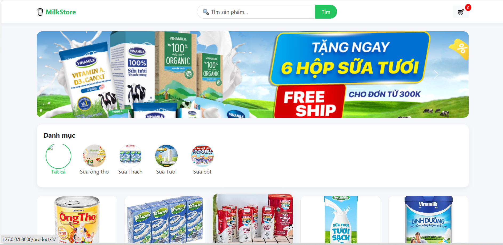
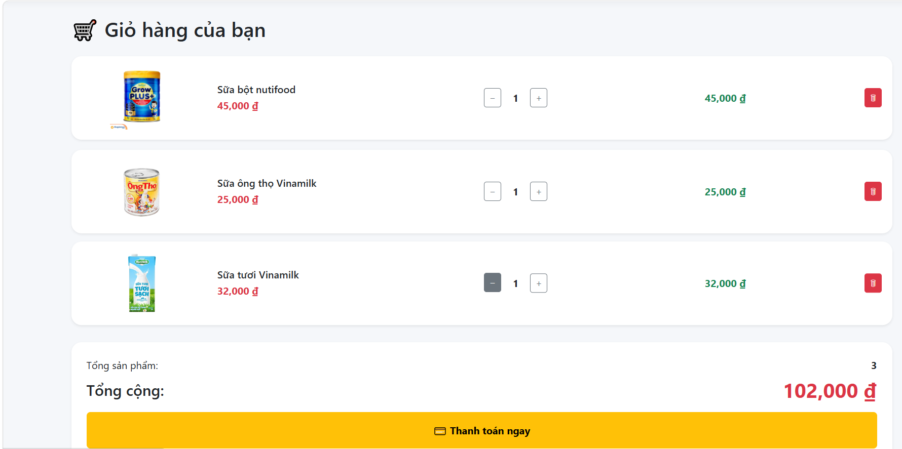
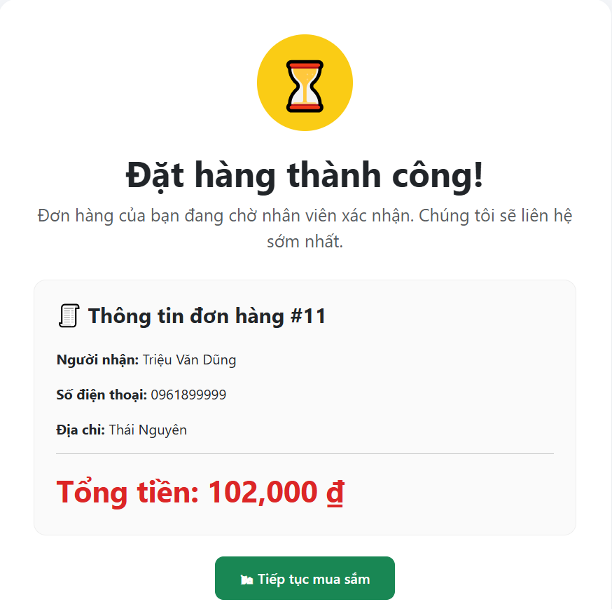
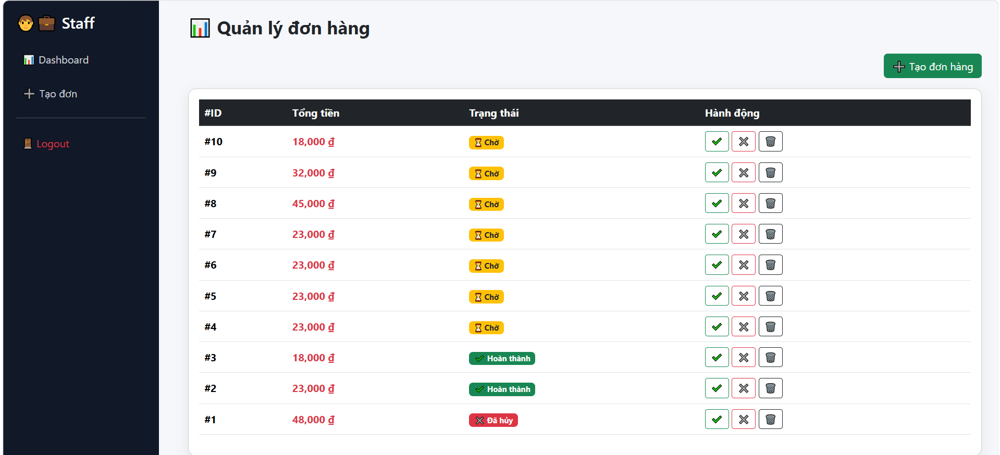

# Website Quản Lý Cửa Hàng Bán Sữa

Dự án “Website quản lý cửa hàng bán sữa” được xây dựng nhằm hỗ trợ hoạt động quản lý và bán hàng tại cửa hàng sữa một cách hiệu quả, hiện đại và tiện lợi. Hệ thống cho phép người dùng tìm kiếm sản phẩm, xem thông tin chi tiết, thêm sản phẩm vào giỏ hàng và thực hiện đặt hàng trực tuyến.

Website được phát triển bằng ngôn ngữ lập trình Python sử dụng Django Framework để xây dựng phần backend và xử lý dữ liệu. Giao diện người dùng được thiết kế bằng HTML, CSS, Bootstrap và JavaScript giúp website có giao diện thân thiện, dễ sử dụng và tương thích trên nhiều thiết bị.

## Công nghệ sử dụng

- Python
- Django Framework
- HTML5
- CSS3
- Bootstrap 5
- JavaScript
- SQLite3

## Chức năng chính

### Người dùng
- Xem sản phẩm
- Tìm kiếm sản phẩm
- Thêm vào giỏ hàng
- Thanh toán đơn hàng
- Đánh giá sản phẩm

### Quản trị viên
- Quản lý đơn hàng
- Xác nhận đơn hàng
- Từ chối đơn hàng
- Xóa đơn hàng
- Theo dõi trạng thái đơn hàng

## Mục tiêu dự án

- Hỗ trợ quản lý bán hàng hiệu quả
- Tăng trải nghiệm người dùng
- Thực hành Django Framework
- Áp dụng kiến thức lập trình web thực tế
## Giao diện hệ thống

### Trang chủ

### Giỏ hàng

### Thanh toán

### Quản lý đơn hàng

